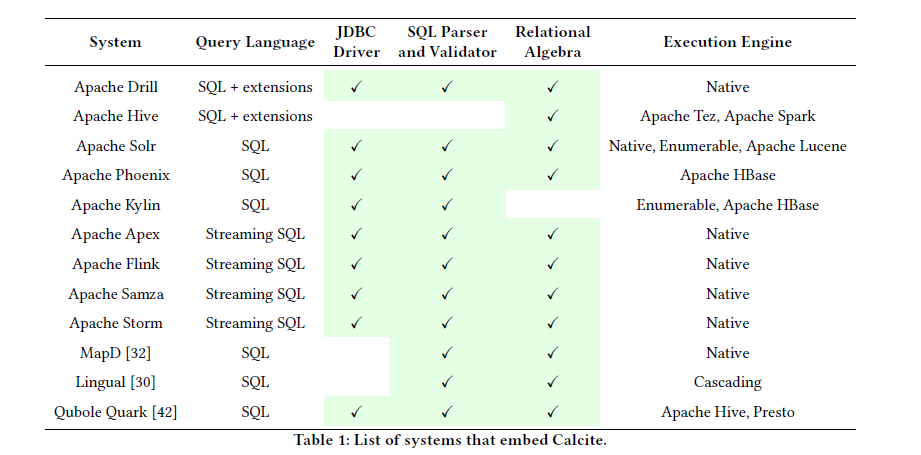
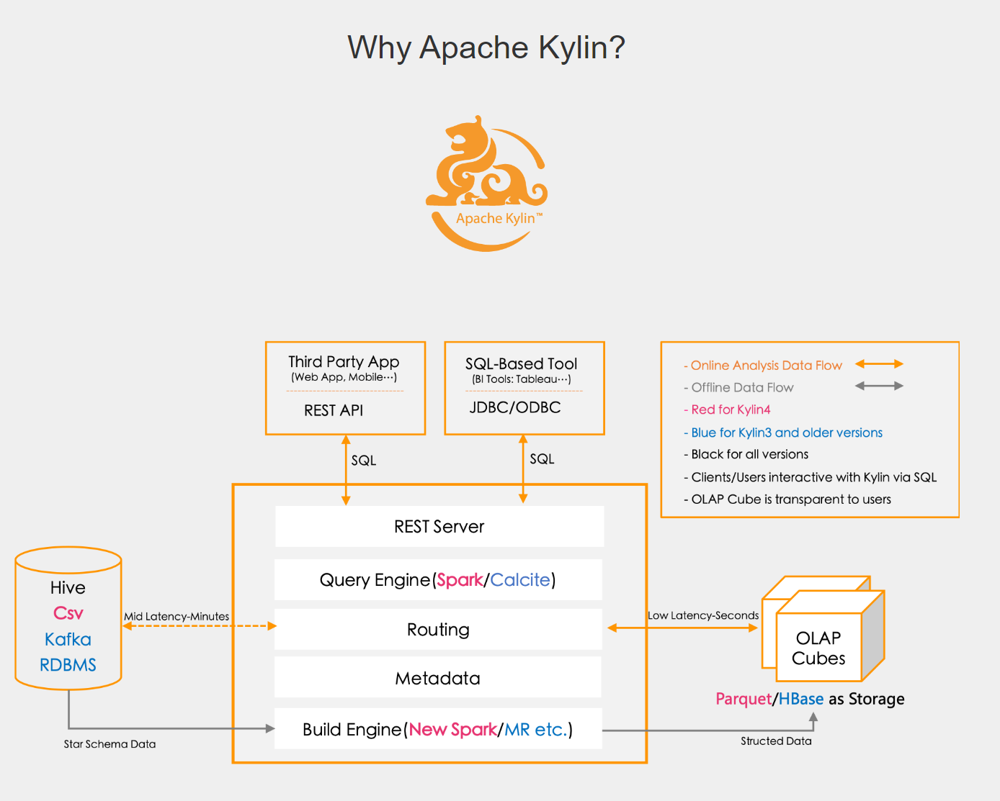

# Study of Systems Embedded with Apache Calcite

In this document, l will introduce several systems that embed with [Apache Calcite](https://github.com/apache/calcite) from following aspects: motivation, optimizer, execution engine and storage.  According to calcite paper, We could have an overview of such systems.

This study is to find a system where better cardinality estimation could lead to better performance. To implement this, I think **this system should satisfy the following conditions**: (1) **OLAP**, we need a system which is compute-bound; (2) **Use calcite as CBO**; (3) **(optional) In-memory**.  

---

## I. [Apache Drill](https://github.com/apache/drill) (2019, Distributed)

### 1. Motivation

Drill is designed from the ground up to support **high-performance analysis on the semi-structured(such as JSON, Parquet, txt and HBase tables)** and rapidly evolving data coming from modern Big Data applications, while still providing the familiarity and ecosystem of ANSI SQL, the industry-standard query language. Drill provides plug-and-play integration with existing Apache Hive and Apache HBase deployments.

It was inspired in part by [Google's Dremel](http://research.google.com/pubs/pub36632.html). Initial release date is in 2019/01/01.

### 2. Optimizer

According to a glimpse of Drill's source code, **drill maybe only use rules of calcite (RBO) to optimize query execution plans**.

### 3. Execution Engine

According to apache calcite paper, drill uses its native execution engine (**maybe Map Reduce which is used in Dremel**).

### 4. Storage

Hadoop data storage system. 

---

## II. [Apache Hive](https://github.com/apache/hive) (2010, Distributed)

### 1. Motivation

The Apache Hive ™ data warehouse software **facilitates reading, writing, and managing large datasets residing in distributed storage using SQL**. Structure can be projected onto data already in storage. A command line tool and JDBC driver are provided to connect users to Hive.

Initial release date is in 2010/10/1.

### 2. Optimizer

**Hive use Calcite's rules and cost model to optimizer query execution plan (RBO+CBO)**.

### 3. Execution Engine

Tez or Spark.

### 4. Storage

Hadoop data storage system.

---

## III. [Apache Solr](https://github.com/apache/solr) (2004, Standalone)

### 1. Motivation

Solr is a search server built on top of Apache Lucene, an open source, Java-based, information retrieval library. It is designed to drive powerful document retrieval applications - wherever you need to serve data to users based on their queries, Solr can work for you. 

Solr offers support for the simplest keyword searching through to complex queries on multiple fields and faceted search results. [Searching](https://solr.apache.org/guide/7_2/searching.html#searching) has more information about searching and queries.

Initial release date: 2004

### 2. Optimizer

Use Apache Calcite Avatica (a subproject of Apache Calcite), maybe RBO.

### 3. Execution Engine

According to calcite paper, Solr uses native execution engine, Enumerable or Apache Lucene.

### 4. Storage

Maybe use storage component of Apache Lucene.

---

## IV. [Apache Phoenix](https://github.com/apache/phoenix) (2014, Distributed)

### 1. Motivation

Become **the trusted data platform for OLTP and operational analytics for Hadoop** through well-defined, industry standard APIs.

Apache Phoenix enables OLTP and operational analytics in Hadoop for low latency applications by combining the best of both worlds:

- the power of standard SQL and JDBC APIs with full ACID transaction capabilities and
- the flexibility of late-bound, schema-on-read capabilities from the NoSQL world by leveraging HBase as its backing store

Apache Phoenix is fully integrated with other Hadoop products such as Spark, Hive, Pig, Flume, and Map Reduce.

### 2. Optimizer

Use calcite as RBO

### 3. Execution Engine

Apache HBase

### 4. Storage

Hadoop.

---

## V. [Apache Kylin](https://github.com/apache/kylin) (2015, Distributed)

### 1. Motivation

Apache Kylin is an open source Distributed Analytics Engine, contributed by eBay Inc., it provides a SQL interface and multi-dimensional analysis (**OLAP**) on Hadoop with support for extremely large datasets.

### 2. Optimizer

RBO

### 3. Execution Engine

Spark

### 4. Storage

Hadoop(offline), HBase(online)

---

## VI. [Apache Apex](https://github.com/apache/apex-core) (closed in 2018, Distributed)

### 1. Motivation

Apache Apex is a unified platform for big data stream and batch processing. Use cases include ingestion, ETL, real-time analytics, alerts and real-time actions. Apex is a Hadoop-native YARN implementation and uses HDFS by default. It simplifies development and productization of Hadoop applications by reducing time to market. Key features include Enterprise Grade Operability with Fault Tolerance, State Management, Event Processing Guarantees, No Data Loss, In-memory Performance & Scalability and Native Window Support. (like hive). 

### 2. Optimizer

Calcite

### 3. Execution Engine

Native

### 4. Storage

Hadoop

---

## VII. [Apache Flink](https://github.com/apache/flink) (2011, Distributed)

### 1. Motivation

Apache Flink is a framework and distributed processing engine for stateful computations over unbounded and bounded **data streams**. Flink has been designed to run in all common cluster environments, perform computations at in-memory speed and at any scale.

### 2. Optimizer

Calcite (SQL parsing and RBO)

### 3. Execution Engine

Native

### 4. Storage

Hadoop, HBase

---

## VIII. [Apache Samza](https://github.com/apache/samza) (2019, Distributed)

### 1. Motivation

Apache Samza is a distributed stream processing framework. It uses Apache Kafka for messaging, and Apache Hadoop YARN to provide fault tolerance, processor isolation, security, and resource management.

### 2. Optimizer

Calcite (SQL parsing and RBO)

### 3. Execution Engine

Native

### 4. Storage

Hadoop

---

## IX. [Apache Storm](https://github.com/apache/storm) (2011, Distributed)

### 1. Motivation

Apache Storm is a distributed stream processing computation framework written predominantly in the Clojure programming language. 

### 2. Optimizer

Calcite (SQL parsing and RBO)

### 3. Execution Engine

Native

### 4. Storage

Hadoop

---

## X. [MapD](https://github.com/heavyai/heavydb) - Formerly OmniSci (Distributed)

### 1. Motivation

OmniSci is a **GPU-powered** database and visual analytics platform for interactive exploration of large datasets. 

### 2. Optimizer

Calcite (RBO)

### 3. Execution Engine

Native

### 4. Storage

Native

---

## XI. [Lingual](https://github.com/Cascading/lingual) (last commit in 2017)

### 1. Motivation

[Lingual](http://www.cascading.org/lingual/) is **true** SQL for Cascading and Apache Hadoop.

Lingual includes JDBC Drivers, SQL command shell, and a catalog manager for creating schemas and tables.

Lingual is under active development on the wip-2.0 branch. All wip releases are made available from `files.concurrentinc.com`. Final releases can be found under `files.cascading.org`.

To use Lingual, there is no installation other than the optional command line utilities.

Lingual is based on the [Cascading](http://cascading.org/) distributed processing engine and the [Optiq](https://github.com/julianhyde/optiq) SQL parser and rule engine.

See the [Lingual](http://www.cascading.org/lingual/) page for installation and usage.

### 2. Optimizer

Calcite (RBO)

### 3. Execution Engine

Cascading

### 4. Storage

Hadoop

---

## XII. Qubole [Quark](https://github.com/qubole/quark) (last commit in 2017)

---

## XIII. Alibaba MaxCompute (Based on Spark)

---

## XIV. Dremio (Distributed) 

### 1. Motivation

A SQL engine for open platforms that provides data warehouse-level performance and capabilities on the data lake, and a self-service experience that makes data consumable and collaborative.

### 2. Optimizer

Calcite (CBO)

### 3. Execution Engine

Native

### 4. Storage

Native